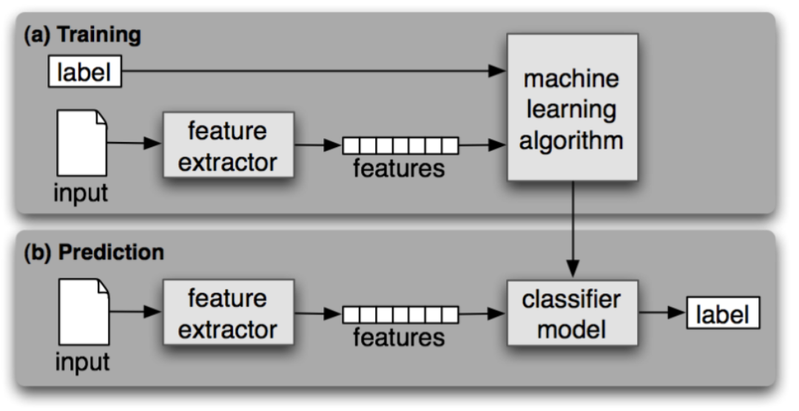

# Sentimental-Analyzer

*Sentiment Analysis also known as Opinion Mining is a field within Natural Language Processing (NLP) that builds systems that try to identify and extract opinions within text. Usually, besides identifying the opinion, these systems extract attributes of the expression e.g.:*

- **Polarity**: If the speaker express a positive or negative opinion,
- **Subject**: The thing that is being talked about,
- **Opinion holder**: The person, or entity that expresses the opinion.

### Types of Sentimental Analysis
**1.** **Rule Based Approach**

Rule-based approaches define a set of rules in some kind of scripting language that identify subjectivity, polarity, or the subject of an opinion.

The rules may use a variety of inputs, such as the following:

Classic NLP techniques like stemming, tokenization, part of speech tagging and parsing.
Other resources, such as lexicons (i.e. lists of words and expressions).
A basic example of a rule-based implementation would be the following:

Define two lists of polarized words (e.g. negative words such as bad, worst, ugly, etc and positive words such as good, best, beautiful, etc).
Given a text:
- Count the number of positive words that appear in the text.
- Count the number of negative words that appear in the text.
- If the number of positive word appearances is greater than the number of negative word appearances return a positive sentiment, conversely, return a negative sentiment. Otherwise, return neutral.

**2.** **Automatic Approach**
 
Automatic methods, contrary to rule-based systems, don't rely on manually crafted rules, but on machine learning techniques. The sentiment analysis task is usually modeled as a classification problem where a classifier is fed with a text and returns the corresponding category, e.g. positive, negative, or neutral (in case polarity analysis is being performed).

***Said machine learning classifier can usually be implemented with the following steps and components:***

